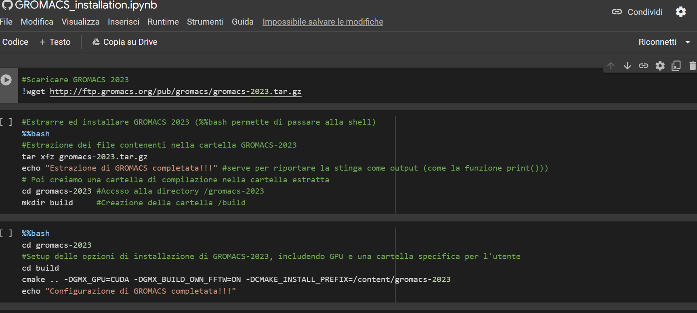
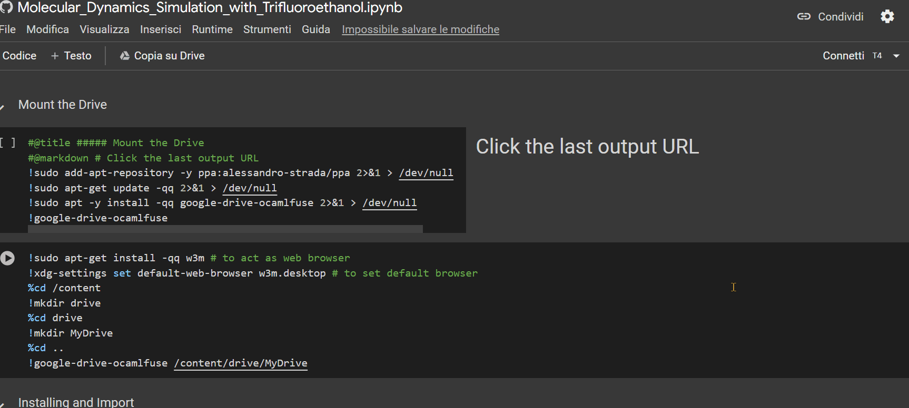
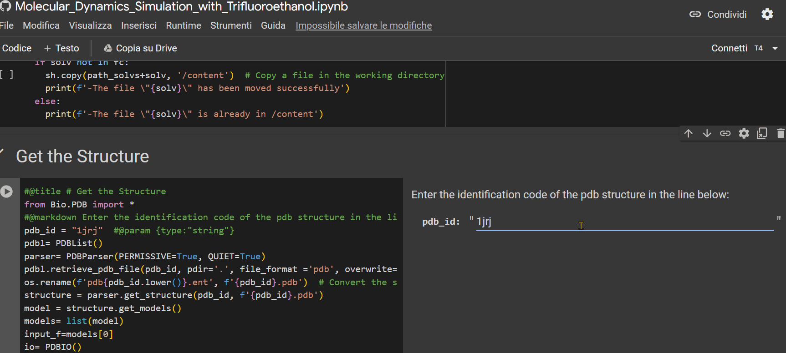
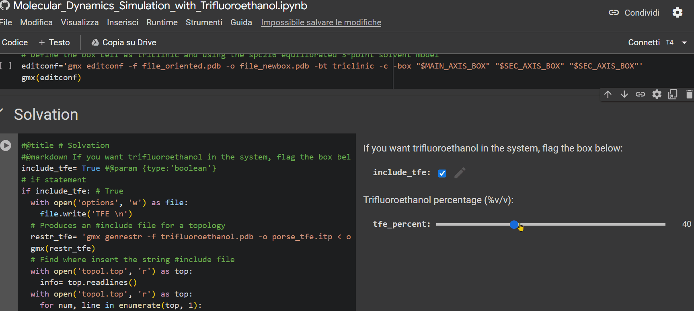
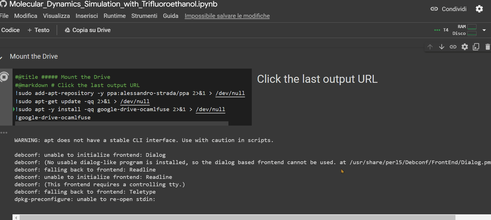
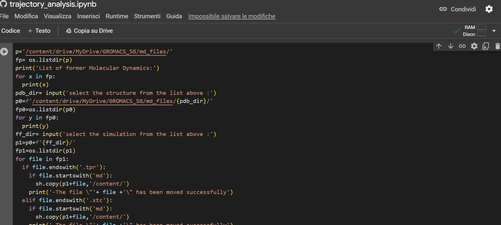

  

# MDS-pVT
MDS-pVT is a system designed for conducting Molecular Dynamics Simulations (MDS) to study peptides in Variable fractions of Trifluoroethanol (pVT).  
The system enables the generation of trajectories for peptides within aqueous or membrane-like environments.

The system is composed by three Notebooks:
1.  The first one needs to install the open source software GROMACS and to adds parameters of trifluoroethanol into the OPLS-aa force field;
1.  The second one is responsible to producing the trajectory of a molecular system using the functionality provided by GROMACS;
1.  The third one is dedicated to analyzing the conformational changes of the peptide throughout the trajectory obtained from the simulation.

The advantage of using this system is that it does not slow down the user's PC because the GROMACS is installed on the Google Drive and the calculations are carried out with the T4 GPUs made available to Google with Colaboratoory.

Furthermore, it is not necessary for the user to have in-depth knowledge of computational chemistry to use this system, the only thing he has to do is enter the pdb identification code of the peptide and enter the percentage of trifluoroethanol in which he wants to simulate.

---
## Tutorial
On this section we are going to see how easy it is to use the MDS-pVT system!

| | Notebook | Description |
| :---: | --- | --- |
|  | GROMACS_Installation.ipynb | Install GROMACS on your Drive |
|  | Molecular_Dynamics_Simulation_with_Trifluoroethanol.ipynb | Run MD simulations on Colab |
|  | trajectory_analysis.ipynb | Analyze the trajectory on Colab |

---
### GROMACS_Installation.ipynb  

Once you open the notebook you need to change the "runtime" type by choosing the T4 GPU option, as shown in the GIF below.  

> [!IMPORTANT]
> Before using this notebook, ensure you're logged into an account with ample free storage space.
> The MDS-pVT system requires approximately 1.95 GB for installation on the drive, and each simulation saves on the drive from 0.37 GB to 1.82 GB of data size.

> [!TIP]
> It's recommended to use an account specifically generated for this system, as GROMACS will be installed on it, and later, the produced simulation trajectories will be saved there.

Then, simply press the <kbd>Ctrl</kbd>+<kbd>F9</kbd> keys to run all the cells in the notebook.  
Just wait a few minutes (approximately 90 minutes), and the notebook will have completed its job.  

Perfect, you have just installed GROMACS on your drive!  

> [!WARNING]
> Before to proceeding with the second notebook, ensure that the entire 1.95 GB of GROMACS files has been successfully loaded onto the drive.  

---
### Molecular_Dynamics_Simulation_with_Trifluoroethanol.ipynb
    
With this notebook, we will generate a simulation based on a few inputs that you need to enter!  
Now, I'll guide you through it in five simple steps:  
1. Enter the alphanumeric PDB identification code of the peptide;

   

1. Specify the percentage of TFE to be inserted into the system for simulation;

   
  
1. If you have a Colab subscription, check the "extended_simulation" box to extend the simulation time (optional);

   
   
1. Ensure that the "runtime" is set to "T4 GPU," then press <kbd>Ctrl</kbd>+<kbd>F9</kbd> to run all cells;

   

1. Click on the URL that appears as the last row output from the "Mount the Drive" cell. A new window will open, where you need to select the account on which you installed GROMACS with the previous notebook. Afterward, click on the 'allow' button.

   

---
### trajectory_analysis.ipynb
  
This last notebook will allow you to extrapolate strictural information about the peptide during its trajectory.  
To upload the simulation files to Colab to proceed with the analysis, follow the example shown in the GIF below.

   

> [!WARNING]
> If there is no subfolder, simply press <kbd>Enter</kbd>.

Whit this Notebook you can:

#### Analyze Compactness and Flexibility:
* Radius of inertia;
* Root Mean Square Deviation (RMSD);
* Root Mean Square Fluctuation (RMSF);
* Solvent-accessible surface area (SASA).

#### Analyze Secondary Structure:
* Ramachandran angle analysis;
* Secondary structure assignment using the DSSP algorithm.

#### Analyze Trajectory:
* PCA to visualize the trajectory.

## Coming soon
In the future, a Docker file will be implemented to facilitate the simulation of larger protein systems on high-performance computers using this system.  

## Reporting Issues or Requesting Analysis

If you encounter any issues with the system or wish to request an analysis on another aspect of the trajectory, we encourage you to send us an email at [GuerrSim96@gmail.com](mailto:guerrsim96@gmail.com).  
We will be happy to assist you and continually improve this project.

Thank you for your contribution!
