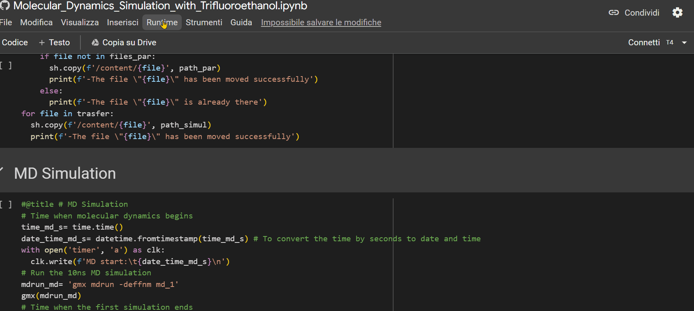

# MDS-PVT
MDS-PVT is a system designed for conducting Molecular Dynamics Simulations (MDS) to study Peptides in Variable fractions of Trifluoroethanol (PVT).
The system enables the generation of trajectories for peptides within aqueous or membrane-like environments.

The system is composed by three Notebooks:
1.  The first one needs to install the open source software GROMACS and to adds parameters of trifluoroethanol into the OPLS-aa force field;
1.  The second one is responsible to producing the trajectory of a molecular system using the functionality provided by GROMACS;
1.  The third one is dedicated to analyzing the conformational changes of the peptide throughout the trajectory obtained from the simulation.

The advantage of using this system is that it does not slow down the user's PC because the GROMACS is installed on the Google Drive and the calculations are carried out with the T4 GPUs made available to Google with Colaboratoory.

Furthermore, it is not necessary for the user to have in-depth knowledge of computational chemistry to use this system, the only thing he has to do is enter the pdb identification code of the peptide and enter the percentage of trifluoroethanol in which he wants to simulate.

## Tutorial
On this section we are going to see how easy it is to use the MDS-PVT system!
### GROMACS_Installation.ipynb 
Once you open the notebook you need to change the "runtime" type by choosing the T4 GPU option, as shown in the GIF below.  

> [!IMPORTANT]
> Before using this notebook, ensure you're logged into an account with ample free storage space.

> [!TIP]
> It's recommended to use an account specifically generated for this system, as GROMACS will be installed on it, and later, the produced simulation trajectories will be saved there.

Then, simply press the <kbd>Ctrl</kbd>]+ <kbd>F9</kbd> keys to run all the cells in the notebook.  
Just wait a few minutes (less than an hour), and the notebook will have completed its job.  
Perfect, you have just installed GROMACS on your drive!  

### Molecular_Dynamics_Simulation_with_Trifluoroethanol.ipynb
With this notebook, we will generate a simulation based on a few inputs that you need to enter!  
Now, I'll guide you through it in five simple steps:  
1. Enter the alphanumeric PDB identification code of the peptide;

   

1. Specify the percentage of TFE to be inserted into the system for simulation;

   
  
1. If you have a Colab subscription, check the "extended_simulation" box to extend the simulation time (optional);

   
   
1. Ensure that the "runtime" is set to "T4 GPU," then press Ctrl+F9 to run all cells;

   

1. Click on the URL that appears as the last output from the "Mount the Drive" cell. A new window will open, where you need to select the account on which you installed GROMACS with the previous notebook. Afterward, click on the 'allow' button.

   

### trajectory_analysis.ipynb

This last notebook will allow you to extrapolate strictural information about the peptide during its trajectory.

#### Compactness and Flexibility:
* Radius of inertia;
* Surface accessible to the solvent;
* Root Mean Square Deviation (RMSD);
* Root Mean Square Fluctuation (RMSF).

#### Secondary Structure Analysis:
* Ramachandran angle analysis;
* Secondary structure assignment using the DSSP algorithm.

 This Notebook is still a work in progress. 
